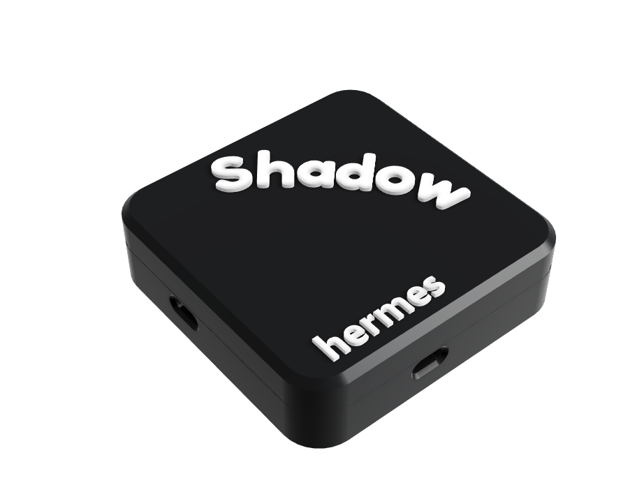
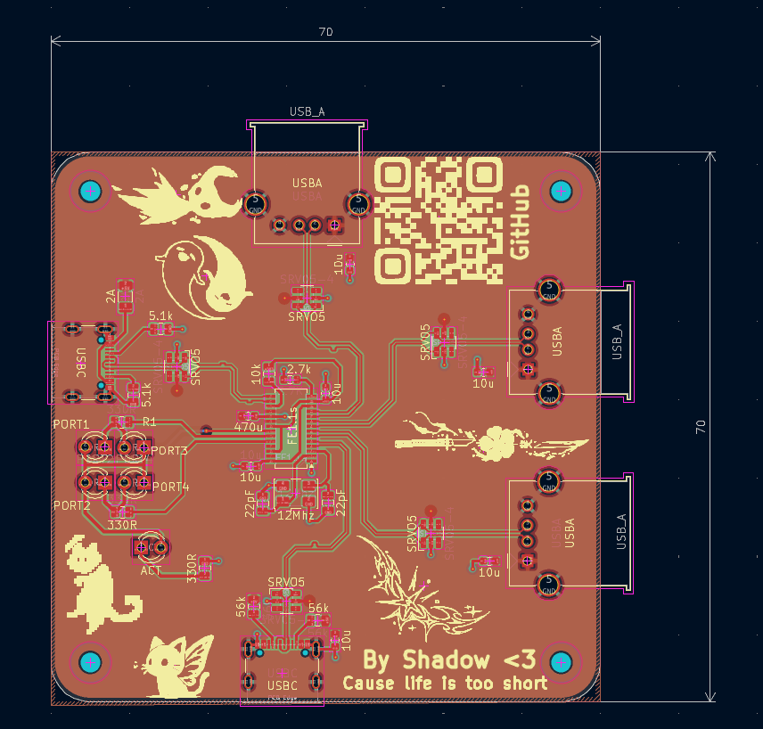
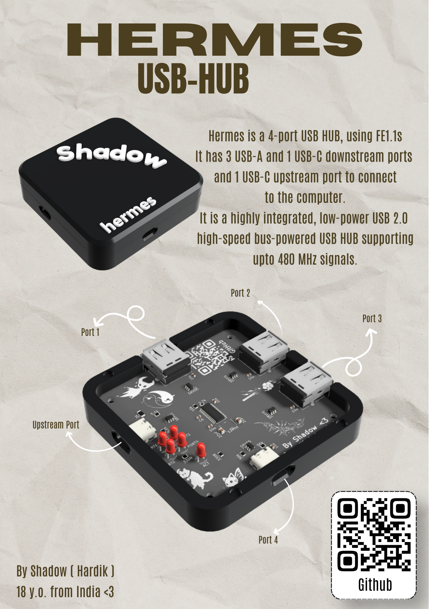

 

## Hermes  
Hermes is a 4-port USB HUB, using FE1.1s. It has 3 USB-A and 1 USB-C downstream ports, and 1 USB-C upstream port for connecting to the computer. It is a highly integrated, low-power USB 2.0 high-speed bus-powered USB HUB supporting upto 480 MHz signals.

This is my first iteration of a USB Hub using the FE1.1s IC. I plan to make future versions with more ports and different ICs, It was built to solve the scarcity of ports on my miserable laptop 

| Animation |
| --- | 
|  |

.png) 

All the components will be hand soldered by me, and the case will be 3D Printed!
The bottom and top cases will be attached together with 4mm magnets!

.png)

The PCB was made in KiCAD (an open-source software), which uses a 4-layer board with a (5V GND 5V GND) stackup to provide a clean GND plane for data signals.
It can support up to 480MHz.

## PCB
| All layers |
| --- | 
|  |

| Without Zones  |
| --- | 
| .png) |  

## Schematics  
| Main IC  |
| --- | 
| .png) |   

| Upstream Port |
| --- | 
| .png) 

| Downstream Ports |
| --- | 
| .png)   

## Simple Build Guide :3  
1. Order the PCBs and the components 
2. Assemble the PCB ( Make sure to have appropriate tools such as a hotplate or a reflow station )
3. Get the case 3D printed!
4. Attach the top and bottom case using 4x1.5mm magnets
5. Start using!!

## BOM   
|Name             |Purpose                      |Quantity|Total Cost (USD)|Link                                                                                                                                              |Distributor|
|-----------------|-----------------------------|--------|----------------|--------------------------------------------------------------------------------------------------------------------------------------------------|-----------|
|PCBs             |PCB                          |5       |14.00           |                                                                                                                                                  |jlcpcb     |
|2A Polyfuse      |fuse                         |1       |0.20            |[link](https://robu.in/product/1812l200-12dr-littelfuse-1812l200-12dr-resettable-fuse-pptc-1812-4532-metric-polyswitch-1812l-series-12-vdc-2-a-3-5-a-2-s/)|robu.in    |
|12 MHz crystal   |crystal oscillator           |1       |0.50            |[link](https://robu.in/product/ysx531sl-12mhz-20pf-10ppm-4pad-smd-smt-crystal/)                                                                           |robu.in    |
|10k ohm resistor |resistor                     |30      |0.10            |[link](https://robu.in/product/rc0805jr-0710kl-yageo-res-thick-film-0805-10k-ohm-5-0-125w1-8w-%C2%B1100ppm-c-pad-smd-t-r/)                                |robu.in    |
|2.7k resistor    |resistor                     |100     |0.10            |[link](https://robu.in/product/ac0603fr-7w2k7l-yageo-res-2-7k-ohm-1-1-5w-0603/)                                                                           |robu.in    |
|5.1k ohm resistor|resistor                     |100     |0.10            |[link](https://robu.in/product/rc0805jr-075k1l-yageo-smd-chip-resistor-5-1-kohm-%C2%B1-5-125-mw-0805-2012-metric-thick-film-general-purpose/)             |robu.in    |
|56k ohm resistor |resistor                     |100     |0.10            |[link](https://robu.in/product/rc0805fr-0756kl-yageo-res-thick-film-0805-56k-ohm-1-0-125w1-8w-%c2%b1100ppm-c-pad-smd-t-r/)                                |robu.in    |
|330 ohm resistors|Resistors                    |100     |1.50            |[link](https://www.amazon.in/Resistor-330-Ohms-0805-pack/dp/B0G1TF1GP)                                                                                   |Amazon     |
|10uF Capacitors  |Decoupling caps              |10      |0.10            |[link](https://robu.in/product/0603x106k160nt-fh-16v-10uf-x5r%c2%b110-0603-multilayer-ceramic-capacitors-mlcc-smd-smt-rohs/)                              |robu.in    |
|SRVO-5           |ESD Protection               |10      |1.50            |[link](https://robu.in/product/srv05-4mr6t1g-onsemi-srv05-4mr6t1g-esd-protection-device-17-5-v-tsop-6-pins-300-w/)                                        |robu.in    |
|USB-A connector  |downstream ports             |5       |0.50            |[link](https://www.flyrobo.in/usb-female-90-usb-socket?tracking=ads)                                                                                      |flyrobo.in |
|USB-C connector  |upstream and downstream ports|2       |0.20            |[link](https://www.flyrobo.in/usb-3.1-type-c-16-pin-onboard-horizontal-smt-female-connector?tracking=ads)                                                 |flyrobo.in |
|FE1.1s           |Main IC                      |1       |1.10            |[link](https://robu.in/product/fe1-1s-bsop28bcn-terminus-tech-ssop-28-150mil-usb-converters-rohs/)                                                        |robu.in    |
|Shipping     |                |     |4.00        |                                                    |           |
|       |                |Total      |24.00 USD           |                                                    |           |

| ZINE |  
| --- |  
|  |  

